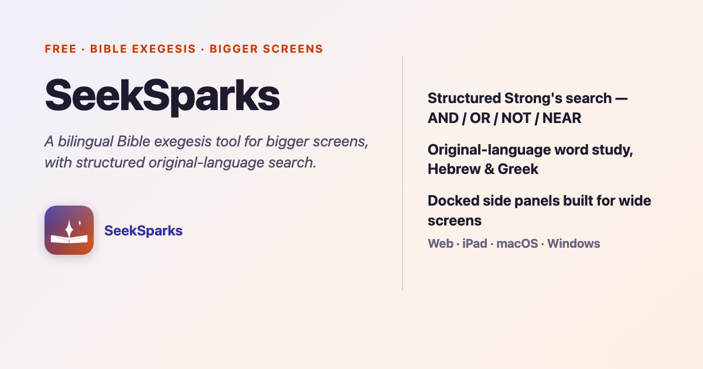

<h1 align="center">SeekSparks</h1>

<p align="center">
  
</p>

<p align="center"><em>A bilingual Bible exegesis tool for bigger screens — structured original-language search, built for iPad web, Mac, and Windows.</em></p>

<p align="center">
  <a href="https://seeksparks.netlify.app">
    
  </a>
  
  
</p>

<p align="center">
  
</p>

---

## What this is

SeekSparks is a sibling of [YsWords](https://github.com/SuyangLiuPaul/YsWords), forked to
serve a different reader: someone doing serious original-language Bible study on an iPad, a
Mac, or a Windows desktop — a bigger screen than a phone, used for longer. Where YsWords is
phone-first and general-audience, SeekSparks defaults to a wide-screen layout (a three-pane
Workbench, or Split View with the sidebar already open) and adds a flagship capability neither
YsWords nor most mobile Bible apps offer: **structured Strong's-number search** — combine
original-language words with AND / OR / NOT and a word-proximity operator, evaluated against a
real Strong's concordance and the per-verse original-language word order, not a live text scan.

It's an homage to what made *BibleWorks* (discontinued 2018) beloved among Hebrew/Greek
students for over a decade — keyboard-first, no-frills, fast structured search — rebuilt on a
modern, free, cross-platform stack. SeekSparks does not use the BibleWorks name, logo, or any
of its code or data; the search grammar and UI here are an independent design informed by
BibleWorks 10's own published help file (`docs/bibleworks-reference.md`).

Current release: **v1.6.236** (`pubspec.yaml`). It has grown well past its original "v1" scope
— a BibleWorks-style radial/strip chronology wheel, an atlas of 1,276 places, and its own
serverless AI-search backend are among the additions since the fork, and none of them are in
YsWords.

---

## Quick start

### For users — nothing to install
Open **<https://seeksparks.netlify.app>** (production also answers at
`sword.yahwehword.com`) in a desktop or iPad browser. On pad-landscape and desktop widths
(≥1024px) the reader opens as the **Workbench** — a BibleWorks-style three-pane workspace:
command line + results on the left, Bible text in the center, and a live original-language
analysis panel on the right that follows your verse taps. At tablet width (600–1023px) the
classic reader opens in Split View with the sidebar already out; its word study docks to the
right at desktop widths and sheets up from the bottom below them.

Native iOS/Android builds also exist (see `tools/release_native.sh` below) but are **not**
published anywhere a stranger could install them — no App Store or Play Store listing, no
public link. They're sideloaded to the maintainer's own iPhone, iPad, and Android tablet with
a free-tier Apple developer profile that expires every seven days. The web build is the only
way anyone else runs this app.

### For developers — clone, run, ship
```bash
git clone https://github.com/SuyangLiuPaul/SeekSparks
cd SeekSparks
flutter pub get
flutter run -d chrome
```

Requires **Flutter >= 3.22** and **Dart >= 3.2** (developed on Flutter 3.44.2 / Dart 3.12.2;
the SDK constraint in `pubspec.yaml` is `'>=3.2.3 <4.0.0'`). On Flutter 3.44 the iOS/macOS
builds stay on CocoaPods — run `flutter config --no-enable-swift-package-manager` once per
machine. (On the maintainer's own Mac, `flutter` is not on `PATH` — the SDK lives at
`~/flutter/bin/flutter`. That's a fact about that one machine, not the project; adjust if your
own install isn't on `PATH` either.)

Before sending a change anywhere, `flutter analyze` should report no issues and
`flutter test` should pass — **4,298 tests**, across 286 files in `test/`, ~70 seconds
(both measured on v1.6.236; re-measure rather than trust that number as it ages).

Shipping is scripted, not manual:

```bash
tools/release_web.sh                          # bump patch version, build, deploy to dev
tools/release_web.sh --no-bump                 # build with the current pubspec version
tools/release_web.sh --include-prod            # ALSO deploy to prod — ask the owner first
tools/release_native.sh                        # build iOS + Android, install to all 3 devices
tools/release_native.sh --ios --no-install      # e.g. build only, iOS only
```

`release_web.sh` is the one entry point that starts a release cycle — it owns the version
bump. `release_native.sh` deliberately does not bump, so web and native ship the same X.Y.Z
instead of drifting a patch apart; it also verifies the version string is actually present in
the built binary before installing, because a stale build cache has silently shipped an old
version before (see `AGENTS.md`).

---

## What SeekSparks ships

| Category | Details |
| --- | --- |
| Structured search | Combine Strong's numbers with **AND** / **OR** / **NOT** / **NEAR*n*** (word-proximity, e.g. `G25 NEAR5 G26` = within 5 words of each other in the same verse) and a `*` prefix wildcard — evaluated over the bundled Strong's concordance, with NEAR narrowed further by the real per-verse word order in the original-language text. Operator chips + a focused "?" help dialog, EN/中文. |
| Workbench (3-pane workspace) | On pad-landscape/desktop (≥1024px) the reader is a BibleWorks-style workspace: command line + results verse list (left), Bible text (center), live original-language analysis that follows verse taps (right). Panes resize by drag, collapse by double-tap / fling / header button, widths persist. A "Classic Reader" menu entry leads back to the single-pane reader (and its Split View). |
| Wide-screen layout | Split View and the sidebar are open by default in the classic reader at tablet width (600–1023px) — no extra tap needed on a bigger screen. |
| Docked side panels | The Original-language word study opens as a persistent right-hand panel at desktop widths (≥1024px) instead of covering the text with a bottom sheet; falls back to the familiar bottom sheet below that width. |
| Reading | 11 Bible editions ship in the build — 5 English (one, NASB, hidden from the picker; see licensing below), 3 Simplified Chinese, 2 Traditional Chinese, 1 unaccented Greek (LXX). Light / Dark / System theme; adjustable font, size, line spacing; paragraph or verse-by-verse mode. |
| Unified command line | One box, BibleWorks' defining interaction: type a reference (`Gen 1:1`, `John 3`, `约翰福音 3:16`) and it navigates; type anything else and it searches. Navigating focuses the verse, so the Browse and Analysis panes follow. |
| Morphology (parsing) | Every original-language word carries a real parse — `Qal perfect 3rd person masculine singular`, `verb · aorist active indicative · 3rd person singular` — in the word-study card, with the part of speech inline on each word chip. 437,952 of 438,821 words (99.8%) carry a morphology code across all 66 books, in EN / 简体 / 繁體 (`tools/audit_data_integrity.py`, check 2a). |
| Analysis window (tabbed) | The right pane is tabbed: **Word Study**, **X-Refs** (TSK + OpenBible cross-references, 29,319 source verses indexed, shown with their text, tappable), **KWIC** (every occurrence of a tapped word, aligned on the word, across the whole Bible), **Related** (verses sharing weighted words with the current one), **Stats** (whole-Bible frequency of the verse's original words, rarest first). The chosen tab persists. |
| Parallel Browse | A BibleWorks Browse-window centre pane: the current verse stacked across every selected translation plus the original-language line, with verse stepping that moves the shared cursor. |
| Word Study | Word-by-word interlinear with Strong's number, transliteration, gloss, and parsing; tap a word for the full lexicon entry, word family, and concordance. Includes a Word List (per chapter or whole book) with a two-book comparison view. |
| World History Wheel | A BibleWorks-style radial chronology (also rendered as a horizontal strip) spanning Creation through church history: 851 dated events, 226 world powers, 82 nations, 44 ministries, organised into 22 historical streams. (`wheel_history.json`'s own `events` array holds 747; `WheelHistoryService.load()` merges 104 more from `bible_timeline.json`, so 851 is what the app draws and what its hub caption prints — `test/wheel_search_test.dart` pins it.) Every date is conventional and independently sourced against public references — none was copied from any copyrighted chart (`docs/WHEEL-PROVENANCE.md`). |
| Atlas, maps & illustrations | 1,276 biblical places with verse links, journey maps, and 1,192 illustration plates (public-domain classics — Tissot, Schnorr, Doré, Rembrandt and others — plus 40 licensed Sweet Publishing plates and 151 whose original source was never recorded, each disclosed in-app rather than assumed public domain). |
| Bible Evidence, Sermons, Timeline, Trivia, Family Tree, Nave's Topical Bible, Hebrew Kings | Sermons: 289 messages by Eric H.H. Chang (张熙和牧师), in English, Simplified, and Traditional Chinese. Family Tree: 277 people. All inherited from YsWords at fork time and independently audited and corrected since — see `docs/DATA-INTEGRITY.md` for the running list of every cross-check. |
| Highlights, bookmarks, notes | Local-first, persisted with `shared_preferences`. Since cloud sync was removed app-wide (see below), this is the *only* place this data lives — the Settings export/import card (Markdown or JSON) is the way to move it between devices. |
| AI search (optional) | An AI-assisted search mode alongside the exact-match one, plus an AI word-explanation card — both call small serverless functions this app owns (`netlify/functions/`, Gemini-backed). This is the one place the app leaves its own device; everything else above runs entirely offline once loaded. |

**Known gaps, stated plainly:**
- English-word → original-language reverse lookup and a spaced-repetition vocabulary trainer
  are not built.
- Morphology-tag colour styling is not built.
- The native iOS/Android builds still carry THIS app's own identity, taken in `0def09c` (2026-08-23) — it is not YsWords', which stays `com.example.yswords` — bundle ID
  `com.example.yahwehswords`, display name "Yahweh's Sword" / 雅伟之剑 — a fork leftover that
  was never rebranded (`android/app/build.gradle.kts`, `ios/Runner/Info.plist`). It hasn't
  mattered because these builds are only ever installed on the maintainer's own three test
  devices, never distributed, but it means the earlier claim that this fork's native identity
  can't collide with YsWords' is in fact true — re-verified 2026-09-06: Sword `com.example.yahwehswords`, Words `com.example.yswords`, World `com.yswords.yahwehsworld`, no two alike — only the web build's identity is
  independent (see "Why this fork is safe to run standalone" below).

---

## Structured search examples

Type into Search — the AND / OR / NOT / NEAR / ✶ chips appear once the query contains a
Strong's-shaped token (`G` or `H` followed by digits):

| Query | Meaning |
| --- | --- |
| `G25 AND G26` | Verses containing **both** ἀγαπάω and ἀγάπη |
| `G25 OR G26` | Verses containing **either** |
| `G25 NOT G26` | Verses with ἀγαπάω but **without** ἀγάπη |
| `G25 NEAR5 G26` | The two words within **5 words** of each other in the same verse — e.g. this returns John 15:9, 1 John 4:7, 1 John 4:10 (verified directly against `assets/originals/john.json` and `assets/originals/1_john.json`: all three sit within 4 words of each other) |
| `G25✶` | Every Strong's number whose digits start with `25` |

`NEAR` is the one that needs more than set membership: it re-checks candidate verses against
the actual word order in `assets/originals/`, so `G25 NEAR1 G26` (adjacent words) is a
materially different, stricter query than `G25 NEAR20 G26`.

---

## Why this fork is safe to run standalone

- **No cloud backend shared with YsWords.** As of v1.6.62, Firebase (`firebase_core`,
  `firebase_auth`, `cloud_firestore`, `firebase_database`) and `google_sign_in` were removed
  from the app **entirely** — not left configured-but-inert. There is no cross-device sync at
  all any more, in either app; the Settings export/import card is the migration path instead.
  Earlier notes in this README describing a placeholder `firebase_options.dart` are stale —
  that file doesn't exist in this tree any more.
- **Own serverless functions, own site.** The AI-search / AI-explain-word / error-report /
  feedback functions in `netlify/functions/` run on SeekSparks' own Netlify site with their
  own environment variables — they are not proxied through, or shared with, YsWords' backend.
- **Own GitHub repo, own Netlify sites** (dev + prod) — no shared deploy target with YsWords.
- **Independent web identity.** Dart package name `seeksparks` (not `yswords`) and its own
  local-storage keys — running this build alongside YsWords in the same browser profile won't
  collide.
- **Native identity is NOT yet independent — see the "Known gaps" row above.** The Android
  `applicationId` and the iOS bundle identifier are both still `com.example.yahwehswords`, and
  the on-device name is still "Yahweh's Sword" / 雅伟之剑, in both `intl` and `cn` build
  flavors. This is a real fork leftover, not a documentation lag — nobody has pointed
  `tools/release_native.sh` at a distinct identity yet. It has not caused a collision so far
  only because these builds have only ever gone to three specific test devices.

---

## Architecture at a glance

A static Flutter web build for the reading experience, plus a small serverless API this app
owns for the two features that genuinely need a model call (AI search, AI word explanation)
and for error/feedback reporting. Bible text, Strong's lexicons, and the concordance index all
ship as bundled JSON in `assets/`; structured search is pure Dart logic
(`lib/utils/strongs_boolean_search.dart` + `lib/utils/strongs_proximity.dart`) over that
already-loaded data — no server round-trip, no new indexing pipeline. Only the AI-assisted
search mode leaves the device.

`lib/` (measured by file count):

```
lib/
  constants/    (18 files)  Strings in 3 locales, theme, bible_versions.dart, app_version.dart
  models/       (22 files)  Parsed shapes for the bundled assets
  pages/        (32 files)  Screens — workbench_page.dart, command_search_page.dart,
                             radial_chronology_page.dart / strip_chronology_page.dart
                             (the wheel, in two forms), family_tree_page.dart, atlas_page.dart…
  providers/    ( 2 files)  App-wide state: main_provider.dart, workbench_provider.dart
  services/     (75 files)  Asset loading/caching, one file per data source
  utils/        (111 files) Pure geometry and parsing logic — this is where testable logic
                             belongs; strongs_boolean_search.dart and strongs_proximity.dart
                             (the search engine) live here
  widgets/      (61 files)  Shared UI — command_pane.dart (Workbench's left pane),
                             docked_panel.dart (the right-docked panel primitive),
                             word_analysis_pane.dart, analysis_tabs.dart
netlify/functions/          The AI search / word-explain / error-report / feedback backend
```

A newcomer (human or AI) reading this repo cold should start with, in order: `AGENTS.md`
(the entry point — see below), `lib/main.dart`, `lib/pages/workbench_page.dart`,
`lib/constants/bible_versions.dart`, and `lib/utils/strongs_boolean_search.dart`.

---

## Data sources & licensing

The **application code** in this repository is released under the
[MIT License](LICENSE); the bundled scripture texts and lexicon data are licensed separately,
per source, and take precedence over the MIT licence on the code.

### Bundled scripture texts

| Version | Language | Licence |
| --- | --- | --- |
| KJV — King James Version (1611/1769) | English | Public domain |
| LEB — Lexham English Bible (2012) | English | © Logos Bible Software · non-commercial study only |
| NASB 2020 (`nasb`) | English | © The Lockman Foundation · used under quotation provisions. **Shipped in the build, but hidden from every UI surface** — the owner's instruction was to take it off the interface without taking it out, while the publisher permission question stays open. `test/data_integrity_test.dart` still pins that `assets/nasb.json` ships. |
| BSB — Berean Standard Bible | English | Dedicated to the public domain by the publisher |
| KJV+S (`kjvs`), LXX+WH (`lxxwh`), 和合本+Strong's (`cuvs-plus`) | English / Greek / Simplified Chinese | Public-domain text; electronic edition and Strong's alignment from **Eagle's View** (Pastor Ho, eaglesviewsoftware.com), imported by `tools/import_eaglesview.py` |
| 和合本雅伟版 — simplified `cuvs-yhwh` and traditional `cuvs-yhwh-tr` | Simplified / Traditional Chinese | © Yahweh De Hua Ministry (yahwehdehua.net) · used with permission |
| 梁家铿译本 (LJK) — simplified `biblexg-v2` and traditional `biblexg-v2-tr` | Simplified / Traditional Chinese | © Bible Exegesis Ministry · used with permission |

**Not the same thing as the above, and never shipped:** `assets/nasb-ev.json`,
`assets/nsn-plus.json`, and `assets/tagged/nsn-plus/` are a *different* NASB-based electronic
module from Eagle's View, whose source carries an explicit "you do not have permission to
redistribute, modify, or profit from this text… Copyright 2002, all rights reserved" notice.
They are listed in `.gitignore`, confirmed absent from `git ls-files`, and not referenced by
`pubspec.yaml` — as of this audit they have never been committed or deployed. If you touch
asset wiring, re-check all three with `git ls-files | grep -E 'nasb-ev|nsn-plus'` before you
commit, because nothing else will stop it from shipping by accident.

### Morphology, lexicons & reference data

| Source | Covers | Licence |
| --- | --- | --- |
| [MorphGNT / SBLGNT](https://github.com/morphgnt/sblgnt) | Greek NT morphology | CC BY-SA 3.0 |
| [Open Scriptures Hebrew Bible (WLC)](https://github.com/openscriptures/morphhb) | Hebrew OT morphology | CC BY 4.0 |
| Strong's Greek + Hebrew Concordance | Both testaments | Public domain (1890s) |
| CBOL Chinese definitions | Lexicon | CC BY-NC-SA 4.0 · non-commercial, derivatives must keep the licence |
| BDB (1906) + Thayer (1889) lexicons | Hebrew / Greek | Public domain originals; Chinese edition used with permission (yahwehdehua.net) |
| Treasury of Scripture Knowledge (Torrey, 1834) + OpenBible.info community votes | Cross-references, 29,319 source verses | Public domain + CC-BY |
| Nave's Topical Bible (Orville J. Nave, 1896) | Topical index | Public domain (CCEL's ThML edition) |

Neither MorphGNT nor OSHB is the same text edition as the Strong's-tagged originals already
bundled, so `tools/merge_morphology.py` aligns them by sequence rather than position and tags
only the words the alignment proves equal — 99.8% of them (437,952 of 438,821 words; see the
table above). The rest are left unparsed on purpose: a wrong parse would be worse than none.
Run `tools/fetch_morphology_sources.sh` then that script to reproduce the merge.

### Sermons and illustrations

Sermons (`assets/sermons/`) are by Eric H.H. Chang (张熙和牧师), used with the pastor's
permission — see `lib/constants/sermon_credit.dart` for the full note on why the name is
spelled that specific way. (`LICENSE`'s third-party notice currently attributes the sermons to
"Liang Jia-keng" instead — that's the 梁家铿译本 Bible translator, a different person and a
different asset. That line in `LICENSE` is wrong and this audit did not touch `LICENSE`.)

Illustrations are a mix: public-domain classical plates (Tissot, Schnorr, Doré, Rembrandt and
others, artists dead over a century), 40 licensed Sweet Publishing plates, and 151 plates whose
original source was never recorded at the time they were collected — those are used by
permission of the app's owner with no licence claimed, and the in-app *About → Attributions*
screen says so plate by plate rather than defaulting to "public domain."

This is a **non-commercial personal / community Bible-study tool**, not affiliated with or
endorsed by any publisher, ministry, or the original BibleWorks software.

---

## The other documents in this repo

This project keeps more process documentation than most, and the roles aren't obvious from the
filenames alone:

| Document | What it's for |
| --- | --- |
| [`AGENTS.md`](AGENTS.md) | **Start here if you're an AI (or a human) picking this project up.** The five-minute orientation: where Flutter lives, the non-negotiable rules, the three traps that have cost the most time, and the current layout. |
| [`PROJECT_STATE.md`](PROJECT_STATE.md) | The compact, current-state answer to "where is this project right now" — what's built, what's queued, what version is deployed where. Maintained every iteration by the unattended work loop. |
| [`HANDOFF.md`](HANDOFF.md) | Append-only running log, newest entry on top, one entry per ship. This is where the *history* of a decision lives, in more detail than `PROJECT_STATE.md` keeps. |
| [`docs/OPEN-ITEMS.md`](docs/OPEN-ITEMS.md) | Everything **not** done, in one place: bugs, unfinished features, decisions waiting on the owner, and operational landmines. Every item is marked either verified on a date or carried forward unchecked, so a reader knows which are facts and which are leads. |
| `docs/DATA-INTEGRITY.md` | Every cross-check ever run against the bundled data, numbered, with a measured count and a verdict for each — the log this README's own numbers are drawn from. |
| `docs/WHEEL-PROVENANCE.md` | Where every date on the World History Wheel came from, and the audit that confirmed none of them were lifted from a copyrighted chart. |
| `docs/PARITY-BACKLOG.md` | What SeekSparks still owes each of the sources it draws on, and what it has deliberately decided not to build. |
| `docs/PRODUCT-AUDIT.md` | A screen-by-screen audit asking "who opens this in a BibleWorks-class tool, and why" — the reasoning behind what stayed and what didn't. |
| `docs/SEARCH-AUDIT.md` | Every syntax the command line accepts, driven once by hand, with the number it actually returned. |
| `docs/DELETION-REVIEW.md` | Things that look unnecessary but were deliberately kept, and the policy for why a human has to sign off before they go. |
| `docs/strip-painter-spec.md` | Spec for the chronology strip's `CustomPainter`, derived line-by-line from the wheel's own painter and constants. |
| `docs/bibleworks-reference.md` | Structural reference distilled from BibleWorks 10's own help file — the source for what "BibleWorks-style" means throughout this codebase. |

Per `AGENTS.md`'s own stated rule: when documents disagree, the tree wins, then `HANDOFF.md` —
and this README is explicitly the least trustworthy of the four top-level documents, because it
is the one least likely to be updated the same day something changes. If you're reading this
and something looks off, check the tree before you believe the README.

---

## Contact / Takedown Requests

**paul.sy.liu@gmail.com** — I commit to responding within 24 hours and acting within 72 hours
on any rights-holder request.

---

> "Your word is a lamp to my feet and a light for my path." — Psalm 119:105
